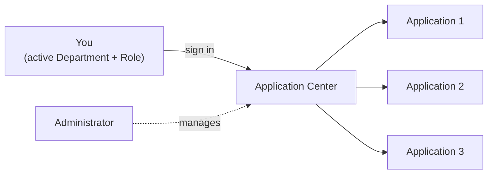
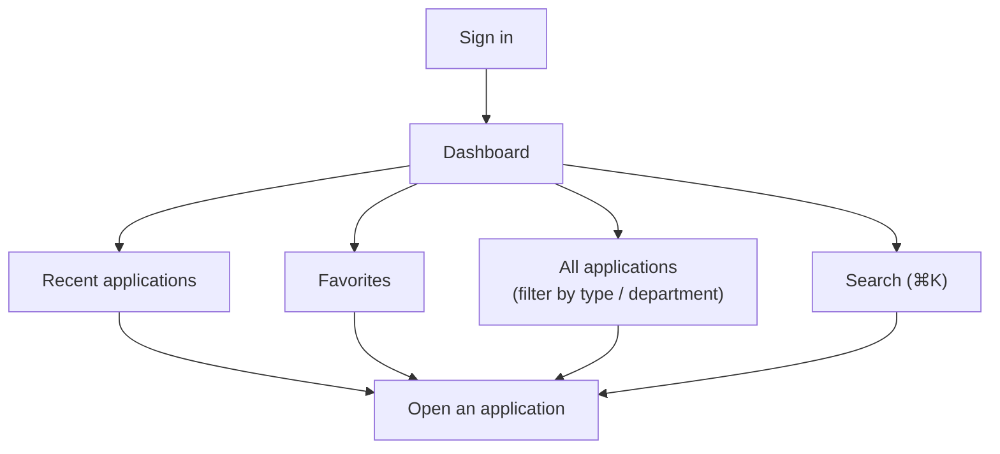
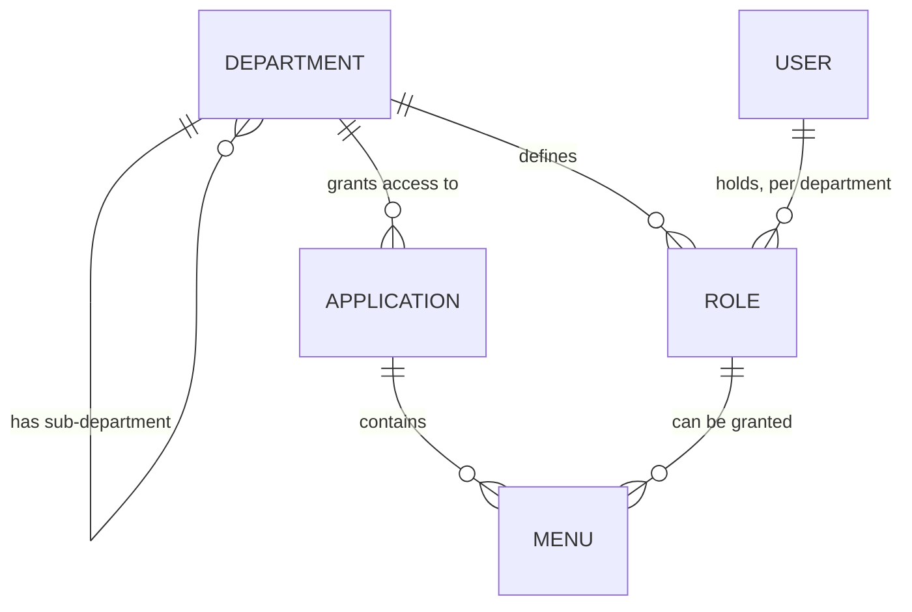
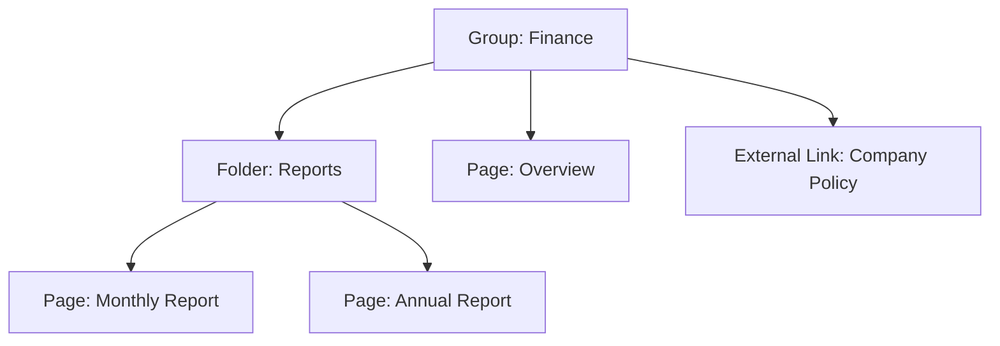
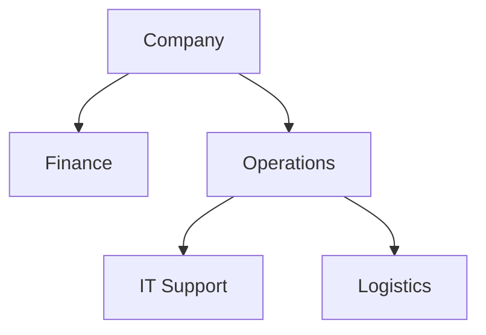
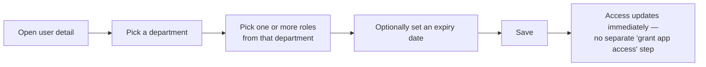
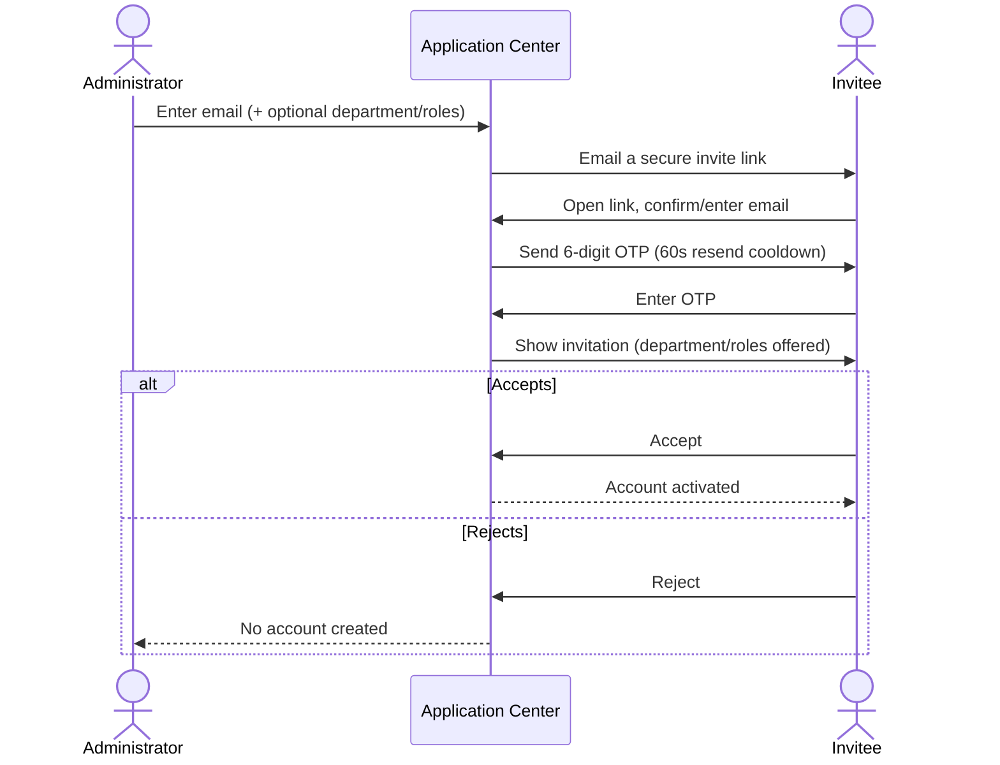
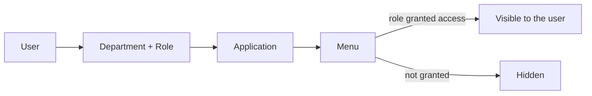

# Application Center — Business Guide

*Versão em português: [BUSINESS_GUIDE.pt.md](BUSINESS_GUIDE.pt.md)*

This guide explains **what the Application Center is for and how it works from a user's point of view** — not how it's built. For technical/developer documentation, see [README.md](../README.md) and [AGENTS.md](../AGENTS.md).

## 1. What is the Application Center

The Application Center is the single front door to every application you're entitled to use inside the organization. Instead of remembering separate links and logins for each system, you sign in once and see a personal dashboard with only the applications relevant to **your department and your role**.

It is also where administrators organize the organization's structure: which applications exist, which departments they belong to, and which people — with which roles — are allowed to use them.

In short, two audiences share the same portal:

- **Every user** — uses the dashboard and their profile to reach the applications they need.
- **Administrators** — use the Settings area to manage applications, departments, and users.



## 2. The Dashboard (Home)

The dashboard is the first thing you see after logging in. It is built around three ideas: *what's relevant to me*, *what I use often*, and *what I've marked as important*.

- **Personal greeting** — a time-of-day greeting and, when you belong to more than one department/role, a reminder of which one is currently active.
- **Recent applications** — the applications you've opened recently appear automatically, so you don't have to search for them again.
- **Favorites** — you can mark any application with a star to pin it to a dedicated "Favorites" panel, always visible on the side of the dashboard.
- **All applications** — every application you have access to, filterable by type (**Internal**, apps that live inside the IGRP ecosystem, or **External**, apps that open on their own site) and by department, using quick filter chips.
- **Search** — a command-style search box (or the ⌘K / Ctrl+K shortcut) to jump straight to an application by name.
- **Active role and department** — if you hold roles in more than one department, only one is "active" at a time. The applications and menus you see are always based on your *active* role/department, not on everything you're entitled to overall. You switch your active context to change what you see.

You only ever see applications that are both **active** (not disabled by an administrator) and **linked to a department where you hold an active role**.



## 3. Your Profile

Your profile page is where you manage your own identity in the system:

- Edit your **name** and upload a **profile picture**.
- See, read-only, **every department and role** you belong to, and every **application** those grant you access to — a quick way to check "why can/can't I see this app?".
- Review and, if needed, **end active sessions** — useful if you signed in on a device you no longer use, or suspect someone else has access to your session.

Administrators viewing another person's profile can additionally activate or deactivate that person's account (see [Managing Users](#43-users) below) — but nobody can deactivate their own account from here.

## 4. For Administrators — the Settings area

Everything under **Settings** is about shaping the organization: the applications that exist, the departments that structure the company, and the people who work in them. The three areas are deeply connected — an application is only useful to someone once it is linked to their department, and a department only grants access once its roles are assigned to real people.



*(Read as: a department defines its own roles and decides which applications it grants; each application has menus, and a role only sees a menu once it has been granted that specific menu.)*

### 4.1 Applications

An application is any system registered in the portal, internal or external. For each application, administrators define:

| Field | Rule |
|---|---|
| Code | Uppercase letters, digits, and underscores only (e.g. `EXPENSES_APP`); at least 2 characters; permanent once set |
| Name | 2–255 characters |
| Type | **Internal** or **External** — chosen at creation and never changed afterwards |
| Slug *(Internal only)* | The relative path used to route to the app inside IGRP — required for Internal apps |
| URL *(External only)* | The full web address the app opens — required for External apps |
| Status | **Active** (visible to eligible users) or **Inactive** (hidden from everyone). Deleting an application is a separate, one-way action that removes it from every list entirely — not the same as marking it Inactive. |
| Description, picture, owner | Optional supporting information |

Beyond the basic record, administrators:

- **Link the application to one or more departments** — this is what makes it show up on those departments' users' dashboards.
- **Define the application's menus** — its internal navigation structure, including their order (set by dragging menu items up or down).
- **Decide which roles can see each menu**, per department — so, for example, within the Finance department only the "Manager" role sees a "Budgets" menu, while other Finance roles don't.

**Menu structure in detail.** A menu isn't just a flat list — each entry has a type that determines how it behaves:

| Menu type | What it is | Can it sit under a Group/Folder? |
|---|---|---|
| **Group** | A top-level heading that organizes menus underneath it | No — always top-level |
| **Folder** | A collapsible sub-section | Yes, optional |
| **Page** | An actual screen inside the application | Yes, optional |
| **External Link** | A link that leaves the application, always opening in a new tab | Yes, optional |



Each menu also has a name and an optional icon. Role access — who can see it — is granted per menu, per department, the same way regardless of the menu's type.

### 4.2 Departments

A department represents an organizational unit — a team, area, or division. Departments can be **nested** (a department can be a sub-department of another), mirroring how the organization is actually structured.

| Field | Rule |
|---|---|
| Code | Uppercase letters, digits, and underscores only; unique |
| Name | At least 2 characters; letters, digits, accented characters, spaces, and basic punctuation (`( ) & . , / -`) |
| Description | Optional |
| Status | **Active** or **Inactive** |
| Parent department | Optional — makes this a sub-department |

The department list is shown as an expandable tree: sub-departments are indented under their parent, inactive departments appear dimmed, and each department has an Edit / Create Sub-department / Delete menu.



From a department's page, administrators also:

- **Choose which applications** are available to that department.
- **Define the roles** that exist within that department (e.g. "Manager", "Analyst"):

  | Field | Rule |
  |---|---|
  | Code | At least 2 characters; unique within the department |
  | Name | 3–50 characters |
  | Description | Optional |
  | Parent role | Optional — groups roles together in the list for readability; it does **not** automatically pass down menu access or permissions from the parent |
  | Status | **Active** or **Inactive** |

- **Grant permissions to roles.** A permission is a short, specific capability (identified by a lowercase code such as `approve-expenses`), scoped to one department, and assigned to a role — not to the department as a whole. It's a finer-grained layer than menu access: a menu decides whether a role can *open* a screen at all, while a permission can gate a specific *action* inside that screen (e.g. an "Approve" button that only appears for roles holding `approve-expenses`).

Departments, like applications and users, can be marked **Active** or **Inactive**; inactive departments no longer grant access to anyone, even if the underlying role assignments still exist.

### 4.3 Users

This is where administrators manage the people who use the system, split into two views: the list of existing users, and the list of invitations.

**Existing users:**

| Field | Rule |
|---|---|
| Name | 3–120 characters |
| Email | A valid, unique email address — used for both login and invitations |
| Status | **Active** or **Inactive** |
| Picture, signature | Optional |

- Search and browse the full list of registered users.
- Toggle a user's status between **Active** (can log in) and **Inactive** (login blocked, without deleting their history).
- Open a user's detail page to see and manage their **departments and roles**.

**Assigning roles to a user:**



An administrator picks a department, then one or more roles from a searchable list scoped to that department, and can optionally set an **expiry date** so the access is automatically time-limited (useful for temporary cover or short-term projects). Removing a role immediately revokes whatever access it granted. A person's list of accessible applications always follows directly from their department/role assignments.

**Inviting new users:**

New people join the system through an invitation, not by self-registering:

1. An administrator enters the person's **email**, and optionally pre-selects a **department** and **roles**.
2. The system emails the invitee a secure link.
3. The invitee opens the link, confirms or enters their email, and verifies it with a **6-digit one-time code (OTP)** sent to that address (a **60-second cooldown** applies before it can be resent, to prevent spamming the invitee's inbox).
4. The invitee reviews the invitation (which department/roles they've been offered) and **accepts** or **rejects** it.
5. On acceptance, their account becomes active with the department/roles from the invite; on rejection, no account is created.



An invitation is always in one of four states: **Pending**, **Accepted**, **Rejected**, or **Canceled**. While it's Pending, administrators can see it in the **Invitations** tab and either **Resend** the email (e.g. if the link stopped working or got lost) or **Cancel** it outright.

## 5. Worked example: setting up the Finance department

To see all the pieces working together, here's a realistic setup from start to finish.

1. **Create the department** — code `FINANCE`, name "Finance".
2. **Create its roles** — inside Finance: `MANAGER` ("Finance Manager") and `ANALYST` ("Finance Analyst").
3. **Create the application** — an Internal app: code `EXPENSES_APP`, name "Expenses", slug `/expenses`, status Active.
4. **Link the application to the department** — "Expenses" is linked to Finance, which is what makes it eligible to appear for Finance users.
5. **Build the menu structure:**

   ```mermaid
   flowchart TD
       G["Group: Expenses"] --> P1["Page: Overview"]
       G --> P2["Page: Approvals"]
       G --> P3["Page: Reports"]
       G --> E["External Link: Expense Policy"]
   ```

6. **Grant menu access per role:**

   | Menu | Manager | Analyst |
   |---|:---:|:---:|
   | Overview | ✅ | ✅ |
   | Approvals | ✅ | ❌ |
   | Reports | ✅ | ✅ |
   | Expense Policy | ✅ | ✅ |

7. **Grant a fine-grained permission** — `approve-expenses` (scoped to Finance) is granted only to Manager. It controls the "Approve" button inside the Approvals page, independently of who can merely open that page.
8. **Invite a new employee** — `maria@example.com` is invited, pre-selecting department Finance and role Analyst. Maria accepts, following the flow in [4.3 Users](#43-users).
9. **The result — what Maria sees.** Because her active role is Finance / Analyst:

   ```mermaid
   flowchart LR
       M["Maria<br/>(Finance · Analyst)"] --> D["Dashboard shows: Expenses"]
       D --> APP["Opens Expenses"]
       APP --> V1["Sees: Overview"]
       APP --> V2["Sees: Reports"]
       APP --> V3["Sees: Expense Policy"]
       APP -.->|not granted| H["Hidden: Approvals"]
   ```

If Maria were later given the Manager role instead of Analyst, she would immediately also see the Approvals menu and the Approve button — no re-invitation needed, since access is driven entirely by her current role, not by anything fixed at invite time.

## 6. How access works, end to end

Everything above connects into one simple rule:

> **You see an application's menu only if you hold a role, in the department that owns that application, and an administrator has granted that specific role access to that specific menu.**

Written as a chain:

```
User  →  (Department + Role)  →  Application  →  Menu  →  Permission
```



This is why the same two administrative actions cover almost every access question:

- **"Why can't this person see application X?"** → Check whether they hold an active role in a department that application is linked to, and whether that role has been granted the relevant menu(s).
- **"How do I give this team access to a new app?"** → Link the application to their department, then make sure their roles are granted the app's menus.

Deactivating any link in that chain (the user, their role, the department, the application, or the menu assignment) removes access without needing to touch anything else. Menu access and permissions are two separate layers, though (see [4.2 Departments](#42-departments)) — a role can lose the ability to *open* a screen without necessarily losing the finer *permissions* it holds, and vice versa.

## 7. Glossary

| Term | Meaning |
|---|---|
| **Application** | A system registered in the portal — internal (inside IGRP) or external (its own site) |
| **Department** | An organizational unit; can have sub-departments |
| **Role** | A named level of access, defined within exactly one department (e.g. "Manager") |
| **Menu** | A navigation entry inside an application. Types: **Group** (top-level heading), **Folder** (collapsible sub-section), **Page** (an actual screen), **External Link** (opens outside the app in a new tab). Access is granted per role, per department. |
| **Permission** | A fine-grained, department-scoped capability (e.g. `approve-expenses`) assigned to a role, gating a specific action beyond simple menu visibility |
| **Active role/department** | The one department+role context currently driving what a user sees, when they hold more than one |
| **Expiry date** | An optional end date on a role assignment, after which that access is automatically revoked |
| **Status: Active** | Visible and usable by whoever is otherwise entitled |
| **Status: Inactive** | Hidden/disabled, kept for record, grants no access |
| **Status: Pending** | An invitation sent but not yet accepted, rejected, or canceled |
| **Favorites** | Applications a user has manually pinned for quick access on their dashboard |
| **Recent** | Applications a user has opened lately, tracked automatically |
