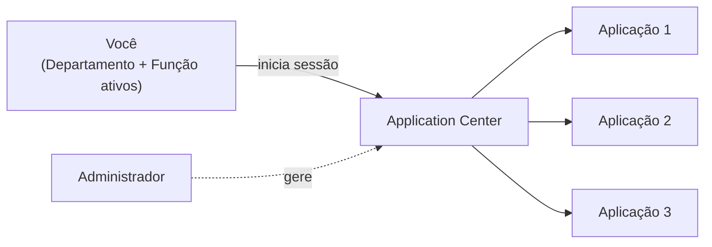
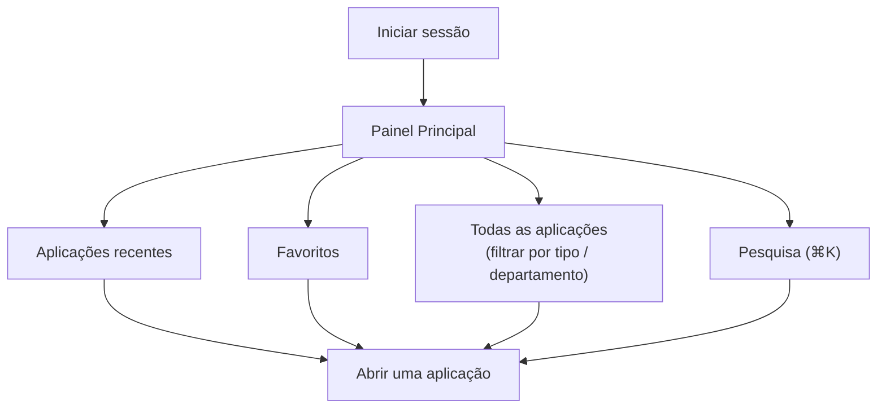
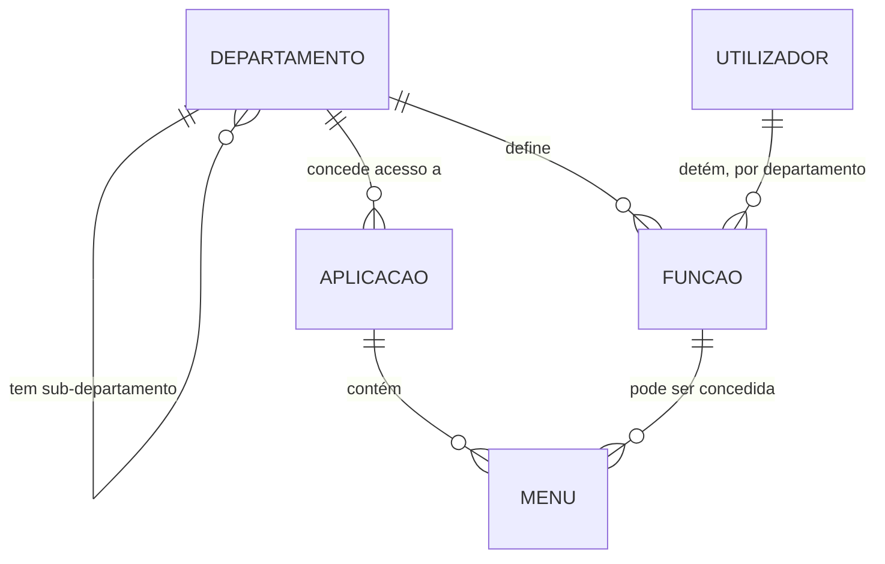
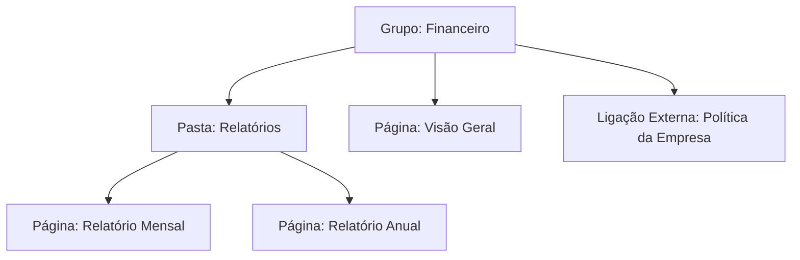
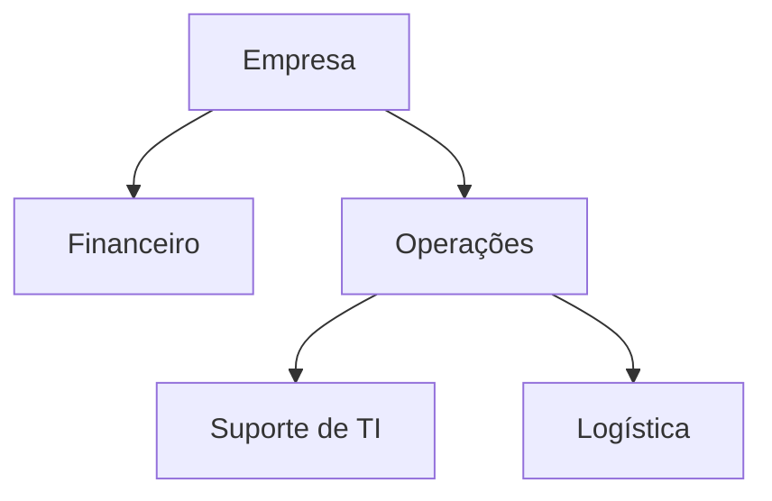
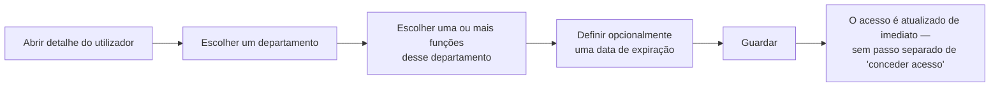
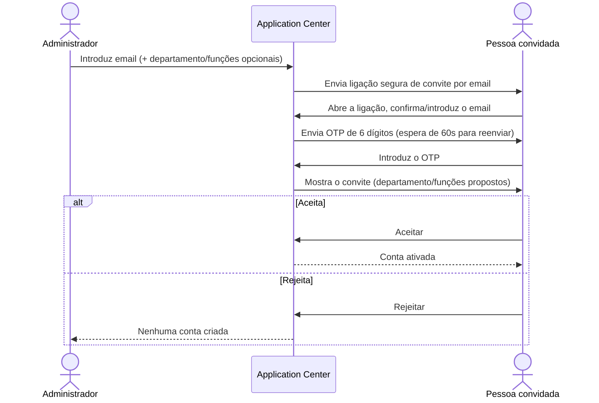
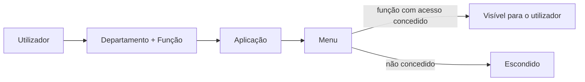

# Application Center — Guia de Negócio

*English version: [BUSINESS_GUIDE.en.md](BUSINESS_GUIDE.en.md)*

Este guia explica **para que serve o Application Center e como funciona do ponto de vista de quem o utiliza** — não como foi construído tecnicamente. Para documentação técnica, consulte [README.md](../README.md) e [AGENTS.md](../AGENTS.md).

## 1. O que é o Application Center

O Application Center é a porta de entrada única para todas as aplicações a que tem direito de acesso dentro da organização. Em vez de memorizar ligações e credenciais separadas para cada sistema, autentica-se uma única vez e vê um painel pessoal apenas com as aplicações relevantes para o **seu departamento e a sua função (role)**.

É também aqui que os administradores organizam a estrutura da organização: que aplicações existem, a que departamentos pertencem, e que pessoas — com que funções — podem utilizá-las.

Em resumo, o mesmo portal serve dois públicos:

- **Qualquer utilizador** — usa o painel principal e o seu perfil para chegar às aplicações de que precisa.
- **Administradores** — usam a área de Definições (Settings) para gerir aplicações, departamentos e utilizadores.



## 2. O Painel Principal (Home)

O painel principal é a primeira coisa que vê depois de iniciar sessão. Está construído à volta de três ideias: *o que é relevante para mim*, *o que uso com frequência* e *o que marquei como importante*.

- **Saudação pessoal** — uma saudação de acordo com a hora do dia e, quando pertence a mais do que um departamento/função, uma indicação de qual está atualmente ativo.
- **Aplicações recentes** — as aplicações que abriu recentemente aparecem automaticamente, sem precisar de as procurar de novo.
- **Favoritos** — pode marcar qualquer aplicação com uma estrela para a fixar num painel dedicado de "Favoritos", sempre visível ao lado do painel principal.
- **Todas as aplicações** — todas as aplicações a que tem acesso, filtráveis por tipo (**Interna**, aplicações que vivem dentro do ecossistema IGRP, ou **Externa**, aplicações que abrem no seu próprio site) e por departamento, através de filtros rápidos.
- **Pesquisa** — uma caixa de pesquisa em estilo de paleta de comandos (ou o atalho ⌘K / Ctrl+K) para ir diretamente a uma aplicação pelo nome.
- **Função e departamento ativos** — se tiver funções em mais do que um departamento, apenas um está "ativo" de cada vez. As aplicações e menus que vê baseiam-se sempre na sua função/departamento *ativo*, e não em tudo a que tem direito no total. Para mudar o que vê, muda o seu contexto ativo.

Só vê aplicações que estejam simultaneamente **ativas** (não desativadas por um administrador) e **associadas a um departamento onde detém uma função ativa**.



## 3. O seu Perfil

A página de perfil é onde gere a sua própria identidade no sistema:

- Editar o seu **nome** e carregar uma **foto de perfil**.
- Consultar, em modo de leitura, **todos os departamentos e funções** a que pertence, e todas as **aplicações** que estes lhe concedem — uma forma rápida de perceber "porque é que vejo (ou não vejo) esta aplicação?".
- Rever e, se necessário, **terminar sessões ativas** — útil se iniciou sessão num dispositivo que já não usa, ou suspeita que outra pessoa tem acesso à sua sessão.

Os administradores que consultam o perfil de outra pessoa podem, adicionalmente, ativar ou desativar essa conta (ver [Gestão de Utilizadores](#43-utilizadores) abaixo) — mas ninguém pode desativar a sua própria conta a partir daqui.

## 4. Para Administradores — a área de Definições

Tudo o que está em **Definições (Settings)** diz respeito a moldar a organização: as aplicações que existem, os departamentos que estruturam a empresa, e as pessoas que neles trabalham. As três áreas estão profundamente ligadas — uma aplicação só é útil a alguém depois de estar associada ao seu departamento, e um departamento só concede acesso depois de as suas funções estarem atribuídas a pessoas reais.



*(Leia-se: um departamento define as suas próprias funções e decide que aplicações concede; cada aplicação tem menus, e uma função só vê um menu depois de lhe ser concedido esse menu específico.)*

### 4.1 Aplicações

Uma aplicação é qualquer sistema registado no portal, interno ou externo. Para cada aplicação, os administradores definem:

| Campo | Regra |
|---|---|
| Código | Apenas letras maiúsculas, números e underscores (ex.: `EXPENSES_APP`); mínimo 2 caracteres; permanente depois de definido |
| Nome | 2 a 255 caracteres |
| Tipo | **Interna** ou **Externa** — escolhido na criação e nunca alterado depois |
| Slug *(apenas Interna)* | O caminho relativo usado para navegar até à aplicação dentro do IGRP — obrigatório para aplicações Internas |
| URL *(apenas Externa)* | O endereço web completo que a aplicação abre — obrigatório para aplicações Externas |
| Estado | **Ativa** (visível para quem tem direito) ou **Inativa** (escondida para todos). Eliminar uma aplicação é uma ação separada e irreversível que a remove por completo de todas as listas — não é o mesmo que marcá-la como Inativa. |
| Descrição, imagem, proprietário | Informação adicional opcional |

Além do registo básico, os administradores:

- **Associam a aplicação a um ou mais departamentos** — é isto que a faz aparecer no painel dos utilizadores desses departamentos.
- **Definem os menus da aplicação** — a sua estrutura de navegação interna, incluindo a ordem (definida arrastando as entradas de menu para cima ou para baixo).
- **Decidem que funções podem ver cada menu**, por departamento — assim, por exemplo, dentro do departamento Financeiro apenas a função "Gestor" vê um menu "Orçamentos", enquanto outras funções desse departamento não o veem.

**A estrutura de menus em detalhe.** Um menu não é apenas uma lista simples — cada entrada tem um tipo que determina o seu comportamento:

| Tipo de menu | O que é | Pode estar dentro de um Grupo/Pasta? |
|---|---|---|
| **Grupo (Group)** | Um cabeçalho de topo que organiza os menus por baixo dele | Não — está sempre no topo |
| **Pasta (Folder)** | Uma subsecção que pode ser recolhida | Sim, opcional |
| **Página (Page)** | Um ecrã real dentro da aplicação | Sim, opcional |
| **Ligação Externa (External Link)** | Uma ligação que sai da aplicação, sempre num novo separador | Sim, opcional |



Cada menu tem também um nome e um ícone opcional. O acesso por função — quem o pode ver — é concedido por menu, por departamento, da mesma forma independentemente do tipo de menu.

### 4.2 Departamentos

Um departamento representa uma unidade organizacional — uma equipa, área ou divisão. Os departamentos podem ser **aninhados** (um departamento pode ser sub-departamento de outro), refletindo a forma como a organização está realmente estruturada.

| Campo | Regra |
|---|---|
| Código | Apenas letras maiúsculas, números e underscores; único |
| Nome | Mínimo 2 caracteres; letras, números, caracteres acentuados, espaços e pontuação básica (`( ) & . , / -`) |
| Descrição | Opcional |
| Estado | **Ativo** ou **Inativo** |
| Departamento-pai | Opcional — torna este num sub-departamento |

A lista de departamentos é apresentada como uma árvore expansível: os sub-departamentos aparecem indentados sob o seu pai, os departamentos inativos aparecem esbatidos, e cada departamento tem um menu de Editar / Criar Sub-departamento / Eliminar.



A partir da página de um departamento, os administradores também:

- **Escolhem que aplicações** estão disponíveis para esse departamento.
- **Definem as funções** que existem dentro desse departamento (ex.: "Gestor", "Analista"):

  | Campo | Regra |
  |---|---|
  | Código | Mínimo 2 caracteres; único dentro do departamento |
  | Nome | 3 a 50 caracteres |
  | Descrição | Opcional |
  | Função-pai | Opcional — agrupa funções na lista para facilitar a leitura; **não** transmite automaticamente o acesso a menus nem permissões da função-pai |
  | Estado | **Ativo** ou **Inativo** |

- **Atribuem permissões a funções.** Uma permissão é uma capacidade curta e específica (identificada por um código em minúsculas, como `approve-expenses`), associada a um departamento, e atribuída a uma função — não ao departamento como um todo. É uma camada mais detalhada do que o acesso a menus: um menu decide se uma função pode *abrir* um ecrã; uma permissão pode condicionar uma *ação* específica dentro desse ecrã (por exemplo, um botão "Aprovar" que só aparece para funções com `approve-expenses`).

Os departamentos, tal como as aplicações e os utilizadores, podem ser marcados como **Ativos** ou **Inativos**; departamentos inativos deixam de conceder acesso a quem quer que seja, mesmo que as atribuições de função subjacentes continuem a existir.

### 4.3 Utilizadores

É aqui que os administradores gerem as pessoas que usam o sistema, dividido em duas vistas: a lista de utilizadores existentes e a lista de convites.

**Utilizadores existentes:**

| Campo | Regra |
|---|---|
| Nome | 3 a 120 caracteres |
| Email | Um endereço de email válido e único — usado tanto para login como para convites |
| Estado | **Ativo** ou **Inativo** |
| Imagem, assinatura | Opcional |

- Pesquisar e consultar a lista completa de utilizadores registados.
- Alternar o estado de um utilizador entre **Ativo** (pode iniciar sessão) e **Inativo** (login bloqueado, sem apagar o seu histórico).
- Abrir a página de detalhe de um utilizador para ver e gerir os seus **departamentos e funções**.

**Atribuir funções a um utilizador:**



Um administrador escolhe um departamento e, depois, uma ou mais funções numa lista pesquisável limitada a esse departamento, podendo opcionalmente definir uma **data de expiração** para que o acesso termine automaticamente (útil para substituições temporárias ou projetos de curta duração). Remover uma função revoga de imediato o acesso que essa concedia. A lista de aplicações a que uma pessoa tem acesso resulta sempre diretamente das suas atribuições de departamento/função.

**Convidar novos utilizadores:**

Novas pessoas entram no sistema através de um convite, e não por auto-registo:

1. Um administrador introduz o **email** da pessoa e, opcionalmente, pré-seleciona um **departamento** e **funções**.
2. O sistema envia ao convidado uma ligação segura por email.
3. O convidado abre a ligação, confirma ou introduz o seu email, e valida-o com um **código de utilização única de 6 dígitos (OTP)** enviado para esse endereço (aplica-se um **tempo de espera de 60 segundos** antes de poder ser reenviado, para evitar sobrecarregar a caixa de correio do convidado).
4. O convidado revê o convite (que departamento/funções lhe foram propostos) e **aceita** ou **rejeita**.
5. Ao aceitar, a sua conta fica ativa com o departamento/funções do convite; ao rejeitar, nenhuma conta é criada.



Um convite está sempre num de quatro estados: **Pendente**, **Aceite**, **Rejeitado** ou **Cancelado**. Enquanto está Pendente, os administradores podem vê-lo no separador **Convites** e **Reenviar** o email (por exemplo, se a ligação deixou de funcionar ou se perdeu) ou **Cancelá-lo** por completo.

## 5. Exemplo prático: configurar o departamento Financeiro

Para ver todas as peças a funcionar em conjunto, aqui está uma configuração realista do início ao fim.

1. **Criar o departamento** — código `FINANCE`, nome "Financeiro".
2. **Criar as suas funções** — dentro do Financeiro: `MANAGER` ("Gestor Financeiro") e `ANALYST` ("Analista Financeiro").
3. **Criar a aplicação** — uma aplicação Interna: código `EXPENSES_APP`, nome "Despesas", slug `/expenses`, estado Ativa.
4. **Associar a aplicação ao departamento** — "Despesas" é associada ao Financeiro, o que a torna elegível para aparecer aos utilizadores do Financeiro.
5. **Construir a estrutura de menus:**

   ```mermaid
   flowchart TD
       G["Grupo: Despesas"] --> P1["Página: Visão Geral"]
       G --> P2["Página: Aprovações"]
       G --> P3["Página: Relatórios"]
       G --> E["Ligação Externa: Política de Despesas"]
   ```

6. **Conceder acesso a menus por função:**

   | Menu | Gestor | Analista |
   |---|:---:|:---:|
   | Visão Geral | ✅ | ✅ |
   | Aprovações | ✅ | ❌ |
   | Relatórios | ✅ | ✅ |
   | Política de Despesas | ✅ | ✅ |

7. **Conceder uma permissão detalhada** — `approve-expenses` (associada ao Financeiro) é concedida apenas à função Gestor. Controla o botão "Aprovar" dentro da página de Aprovações, independentemente de quem pode simplesmente abrir essa página.
8. **Convidar uma nova colaboradora** — `maria@example.com` é convidada, pré-selecionando o departamento Financeiro e a função Analista. Maria aceita, seguindo o fluxo em [4.3 Utilizadores](#43-utilizadores).
9. **O resultado — o que a Maria vê.** Como a sua função ativa é Financeiro / Analista:

   ```mermaid
   flowchart LR
       M["Maria<br/>(Financeiro · Analista)"] --> D["Painel mostra: Despesas"]
       D --> APP["Abre Despesas"]
       APP --> V1["Vê: Visão Geral"]
       APP --> V2["Vê: Relatórios"]
       APP --> V3["Vê: Política de Despesas"]
       APP -.->|não concedido| H["Escondido: Aprovações"]
   ```

Se a Maria fosse mais tarde promovida à função de Gestora em vez de Analista, passaria a ver de imediato o menu Aprovações e o botão Aprovar — sem necessidade de novo convite, pois o acesso é sempre determinado pela sua função atual, e não por algo fixado no momento do convite.

## 6. Como funciona o acesso, de ponta a ponta

Tudo o que foi descrito acima resume-se a uma regra simples:

> **Só vê o menu de uma aplicação se tiver uma função, no departamento a que essa aplicação pertence, e se um administrador tiver concedido a essa função específica acesso a esse menu específico.**

Escrito como uma cadeia:

```
Utilizador  →  (Departamento + Função)  →  Aplicação  →  Menu  →  Permissão
```



É por isso que quase todas as questões de acesso se resolvem com as mesmas duas ações administrativas:

- **"Porque é que esta pessoa não vê a aplicação X?"** → Verificar se detém uma função ativa num departamento a que essa aplicação está associada, e se essa função tem acesso concedido aos menus relevantes.
- **"Como dou acesso desta equipa a uma nova aplicação?"** → Associar a aplicação ao departamento da equipa e garantir que as suas funções têm acesso concedido aos menus dessa aplicação.

Desativar qualquer elo dessa cadeia (o utilizador, a sua função, o departamento, a aplicação, ou a atribuição do menu) remove o acesso sem ser necessário tocar em mais nada. O acesso a menus e as permissões são duas camadas separadas, no entanto (ver [4.2 Departamentos](#42-departamentos)) — uma função pode perder a capacidade de *abrir* um ecrã sem necessariamente perder as *permissões* mais detalhadas que detém, e vice-versa.

## 7. Glossário

| Termo | Significado |
|---|---|
| **Aplicação** | Um sistema registado no portal — interna (dentro do IGRP) ou externa (site próprio) |
| **Departamento** | Uma unidade organizacional; pode ter sub-departamentos |
| **Função (Role)** | Um nível de acesso nomeado, definido dentro de exatamente um departamento (ex.: "Gestor") |
| **Menu** | Uma entrada de navegação dentro de uma aplicação. Tipos: **Grupo** (cabeçalho de topo), **Pasta** (subsecção recolhível), **Página** (um ecrã real), **Ligação Externa** (abre fora da aplicação, num novo separador). O acesso é concedido por função, por departamento. |
| **Permissão** | Uma capacidade detalhada, associada a um departamento (ex.: `approve-expenses`), atribuída a uma função, que condiciona uma ação específica para além da simples visibilidade de menus |
| **Função/departamento ativo** | O contexto de departamento+função atualmente a determinar o que um utilizador vê, quando detém mais do que um |
| **Data de expiração** | Uma data de fim opcional numa atribuição de função, após a qual esse acesso é automaticamente revogado |
| **Estado: Ativo** | Visível e utilizável por quem tem direito |
| **Estado: Inativo** | Escondido/desativado, mantido para registo, não concede acesso |
| **Estado: Pendente** | Um convite enviado mas ainda não aceite, rejeitado ou cancelado |
| **Favoritos** | Aplicações que um utilizador fixou manualmente para acesso rápido no seu painel |
| **Recentes** | Aplicações que um utilizador abriu recentemente, registadas automaticamente |
