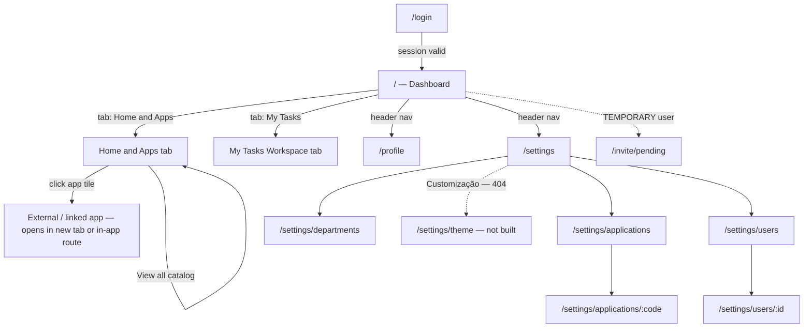

# Home / Applications Center Flow

How `src/app/(igrp)/(home)` works: the authenticated landing experience (app launcher + task workspace) and the `/settings` management screens nested under it. This is the deep dive behind [DEVELOPER_GUIDE.md §11](DEVELOPER_GUIDE.md#11-the-workspace-dashboard-feature) — read that first for the wider request lifecycle.

- [1. Page inventory — what exists](#1-page-inventory--what-exists)
- [2. Navigation flow](#2-navigation-flow)
- [3. Route map](#3-route-map)
- [4. Layout chain & guards](#4-layout-chain--guards)
- [5. The dashboard page (`/`)](#5-the-dashboard-page-)
- [6. EnterpriseWorkspace — Home & Apps tab](#6-enterpriseworkspace--home--apps-tab)
- [7. EnterpriseWorkspace — Tasks tab](#7-enterpriseworkspace--tasks-tab)
- [8. Data sources — what's real vs. mock](#8-data-sources--whats-real-vs-mock)
- [9. Settings section (`/settings/*`)](#9-settings-section-settings)
- [10. Profile (`/profile`)](#10-profile-profile)
- [11. Known gaps / things to watch](#11-known-gaps--things-to-watch)

---

## 1. Page inventory — what exists

Every screen reachable under `(home)`, its route, and its real build status (not just "does the file exist" — whether it renders real data or a placeholder):

| # | Page | Route | Status |
| --- | --- | --- | --- |
| 1 | Dashboard — Home & Apps tab | `/` | ✅ Live — real app/user data |
| 2 | Dashboard — My Tasks Workspace tab | `/` (tab, no URL change) | ⚠️ UI-complete, **mock data only** |
| 3 | Profile | `/profile` | ✅ Live |
| 4 | Settings hub | `/settings` | ✅ Live (static card grid) |
| 5 | Applications — list | `/settings/applications` | ✅ Live |
| 6 | Applications — detail | `/settings/applications/[code]` | ✅ Live |
| 7 | Departments — tree | `/settings/departments` | ✅ Live |
| 8 | Users — list + invitations | `/settings/users` | ✅ Live |
| 9 | Users — detail | `/settings/users/[id]` | ✅ Live |
| 10 | Customização (theming) | `/settings/theme` | ❌ **Does not exist** — linked from the settings hub card but no route is implemented; navigating there 404s |

There is no dedicated URL for the Tasks tab — it's client-side state (`activeTab`) inside `EnterpriseWorkspace`, not a route, so it can't be deep-linked or bookmarked as-is.

## 2. Navigation flow



Entry points into this flow: a normal login (see [AUTHENTICATION.md](AUTHENTICATION.md)) lands on `/` after `NEXT_PUBLIC_IGRP_APP_HOME_SLUG`; a freshly-invited user whose account is still `TEMPORARY` is redirected out of `(home)` entirely to `/invite/pending` (see [§4](#4-layout-chain--guards)) before reaching the dashboard.

## 3. Route map

```
src/app/(igrp)/(home)/
├── layout.tsx                          gate: temporary-user redirect
├── page.tsx                            "/" — the dashboard (EnterpriseWorkspace)
├── profile/page.tsx                    "/profile"
└── settings/
    ├── layout.tsx                      centers content, max-w-7xl container
    ├── page.tsx                        "/settings" — card grid linking to the 3 areas below
    ├── applications/
    │   ├── page.tsx                    "/settings/applications" — list
    │   └── [code]/page.tsx             "/settings/applications/[code]" — detail
    ├── departments/page.tsx            "/settings/departments" — tree view
    └── users/
        ├── page.tsx                    "/settings/users" — list + invitations
        └── [id]/page.tsx               "/settings/users/[id]" — detail
```

`(home)` is itself nested inside `(igrp)`, which is the authenticated shell (see [ARCHITECTURE.md](ARCHITECTURE.md)). Every route here already has a valid session and IGRP layout chrome by the time its own code runs.

## 4. Layout chain & guards

```
(igrp)/layout.tsx        verifySession() → igrpGetClaims() → IGRPLayoutFull (header, no sidebar)
  → (home)/layout.tsx     verifySession() again (belt-and-braces) + a business-rule redirect
      → page.tsx / settings/... / profile/...
```

[`(home)/layout.tsx`](../src/app/(igrp)/(home)/layout.tsx) does one job beyond re-confirming the session: it fetches `getCurrentUser()` in parallel with `getLayoutConfig()` and redirects **TEMPORARY** users to `/invite/pending` before anything under `(home)` renders:

- A `403` from Access Management on `getCurrentUser()` almost always means the caller's access token doesn't carry the expected role yet — most commonly a user who just accepted an invite but whose token hasn't refreshed, or a `TEMPORARY`-status user navigating straight to `/`. That's treated as "go finish onboarding," not an error.
- Any other failure re-throws, which bubbles to `(igrp)/error.tsx`.
- A `TEMPORARY` user status (checked directly on the fetched user, not just the 403 path) also redirects to `/invite/pending`.

This means **every** page under `(home)` — dashboard, settings, profile — implicitly requires a non-temporary user; you don't need to repeat that check further down.

`settings/layout.tsx` is purely presentational: it wraps its children in `container mx-auto max-w-7xl`.

## 5. The dashboard page (`/`)

[`(home)/page.tsx`](../src/app/(igrp)/(home)/page.tsx) is a server component that:

1. Calls `prefetchCurrentUserDashboard(queryClient)` — a single helper ([`src/features/users/prefetch.ts`](../src/features/users/prefetch.ts)) that fires **7 queries in parallel** so the whole launcher hydrates without pop-in: current user, active role, roles, departments, applications, favorite applications, recent applications.
2. Wraps the tree in `<HydrationBoundary state={dehydrate(queryClient)}>` — the standard Next.js App Router + TanStack Query SSR-prefetch pattern used throughout this app (the same shape appears in the applications/departments/profile pages).
3. Renders `<EnterpriseWorkspace />` inside a fixed-height, non-scrolling wrapper: `h-(--home-scroll-h) lg:h-(--home-scroll-h-lg) overflow-hidden`. Those two CSS variables (defined in `src/styles/app-center.css`) size the launcher to exactly fill the viewport below the IGRP header — see [DEVELOPER_GUIDE.md §10](DEVELOPER_GUIDE.md#10-design-tokens--theming). The dashboard is the one route designed to never scroll at the page level; only its internal panes scroll.

Failure semantics: `prefetchCurrentUserDashboard` uses `fetchQuery` (throws on failure) for the current-user call — without it the launcher is unusable, so a failure surfaces the route's status/error page. The other six calls also use `prefetchQuery` with a throwing `queryFn`, but because they're independent entries in the query cache, a failure there fails only that one card client-side (e.g. a broken favorites call doesn't blank the whole dashboard) once the client re-fetches.

## 6. EnterpriseWorkspace — Home & Apps tab

[`EnterpriseWorkspace`](../src/features/workspace/components/enterprise-workspace.tsx) is a client component owning one piece of state: `activeTab: "home" | "tasks"`. It renders a sticky tab bar (indigo active-underline, badge showing pending task count) and swaps between `HomeAppsTab` and `TasksTab`.

`HomeAppsTab` stacks three sections top-to-bottom:

1. **`WelcomeBanner`** — avatar circle (first letter of the user's name) with an online-status dot, a time-of-day greeting (`getGreeting()` — "Good morning/afternoon/evening", computed client-side in a `useEffect` to avoid an SSR/client clock mismatch), the user's first name, their active role badge, and a one-line pending/due-today task summary. Reads `useCurrentUser()` and `useCurrentUserActiveRole()`.
2. **`RecentlyAccessed`** — a horizontally-scrolling row of up to 8 apps from `useGetCurrentUserRecentApplications()`, rendered as compact `AppTileCard`s. Renders nothing (`return null`) when there's no recent-access history. Its "View all catalog →" link does an in-page smooth-scroll to the catalog section (`APP_CATALOG_SECTION_ID`), not a navigation.
3. **`AppCatalog`** — the full application directory: search-by-name, a "Favorites" toggle filter, a sort dropdown (Recommended / Recently Visited / Name A–Z / Name Z–A), and a grid/list view toggle. Backed by `useCurrentUserApplications()` + `useCurrentUserFavoriteApplications()`; favoriting is optimistic via `useAddCurrentUserFavoriteApplication()` / `useRemoveCurrentUserFavoriteApplication()`.

**`AppTileCard`** (shared by both sections) resolves per-app display via `src/features/workspace/lib/app-utils.ts`:

- `getAppTileColor(code)` — deterministic hash of the app code into one of 8 color pairs, so each app always gets the same tile color across sessions/renders.
- `getAppHref(app)` — `APP_IGRP_CENTER` special-cases to the local `/applications` route; everything else uses `app.url ?? app.slug`.
- `isExternalAppHref(app, href)` — `true` when `app.type === "EXTERNAL"` or the href is absolute (`http(s)://`); external apps render as a plain `<a target="_blank">`, internal ones as a typed `<Link>`.
- `getLastOpenedLabel(lastAccess)` — relative-time formatting ("Opened just now" → "… minutes/hours ago" → "yesterday" → weekday name → "N weeks ago").

Apps with no resolvable href render as a static (non-clickable) card — favoriting still works, launching doesn't.

## 7. EnterpriseWorkspace — Tasks tab

`TasksTab` is a two-column layout (`TaskList` + `WorkSummarySidebar`, sidebar fixed at `320px`):

- **`TaskList`** — 4 tabs (Assigned to me / Candidate tasks / Created by me / Completed) each showing a live count badge, plus a free-text filter across title/ticket code/category. Renders `TaskRow` per visible task. Header shows the user's active role as "Role Scope" (`useCurrentUserActiveRole()`), purely informational at this point.
- **`WorkSummarySidebar`** — 4 stat cards (Overdue / Due today / Due this week / Total pending), each color-coded (red/amber/blue/gray) via a left accent border, plus a completion-rate progress bar (`completedCount / total`).

Both read `computeTaskStats()` from [`lib/task-utils.ts`](../src/features/workspace/lib/task-utils.ts), which also exposes `getDueDateLabel()` (color-coded "Overdue by N days" / "Due today" / "Due in N days", used by `TaskRow`). Note the stats function **trusts the task's static `priority: "OVERDUE"` field** rather than deriving overdue-ness from `dueDate` — acceptable for hand-authored mock data, but a real task-service integration should compute it from the date instead (flagged in the code as-is).

## 8. Data sources — what's real vs. mock

This is the most important thing to know before changing anything here:

| Data | Source | Real or mock? |
| --- | --- | --- |
| Current user, active role, roles, departments | `src/actions/user.ts` → Access Management SDK | **Real** |
| Applications, favorites, recent applications | `src/actions/user.ts` (`getCurrentUserApplications`, `*FavoriteApplications`, `*RecentApplications`) | **Real** |
| Tasks (assigned/candidate/created/completed, due dates, priorities) | `src/features/workspace/data/mock-tasks.ts` → `defaultTasks`, consumed directly by `EnterpriseWorkspace` | **Mock, hardcoded** — no `use-tasks.ts` hook, no server action, no SDK call exists yet |

The task-management side of the dashboard is a UI-complete prototype: the tab counts, filters, sidebar stats, and due-date logic all work against static seed data. Wiring it to a real backend means introducing a `tasks` feature module (server action + `use-tasks.ts` React Query hook) and swapping `defaultTasks` in `EnterpriseWorkspace` for that hook's data — the component tree underneath (`TaskList`, `TaskRow`, `WorkSummarySidebar`) already expects `Task[]` and needs no shape changes.

## 9. Settings section (`/settings/*`)

`/settings` itself ([`settings/page.tsx`](../src/app/(igrp)/(home)/settings/page.tsx)) is a static card grid (`SettingsCard`) pointing at three live areas and one placeholder:

| Card | Route | Status |
| --- | --- | --- |
| Gestão de Aplicações | `/settings/applications` | live |
| Gestão de Utilizadores | `/settings/users` | live |
| Gestão de Acessos | `/settings/departments` | live |
| Customização | `/settings/theme` | **`status: "inativo"`** — no route exists yet |

Each live area follows the same server-prefetch + client-feature-component pattern as the dashboard:

- **Applications** — `settings/applications/page.tsx` prefetches via `prefetchApplicationsList()` and renders `<ApplicationList>`; `[code]/page.tsx` prefetches a single app (`prefetchApplicationByCode`, also used to derive `generateMetadata`'s page title) and renders `<ApplicationDetails code={code}>`. Both from `src/features/applications/`.
- **Departments** — `settings/departments/page.tsx` prefetches `prefetchDepartments()` and renders `<DepartmentListTree>` (`src/features/departments/`) — a hierarchical view, not a flat list.
- **Users** — `settings/users/page.tsx` is the one page in this section that fetches directly with server actions instead of the prefetch/hydrate pattern: `getUsers()` + `getUserInvitations()` in parallel. Users are page-critical (a failure throws `HttpStatusError`, caught by `error.tsx`); invitations are supplementary (a failure degrades to an empty list rather than failing the page) — a concrete example of the error-handling split described in [DEVELOPER_GUIDE.md §8](DEVELOPER_GUIDE.md#8-data-layer-server-actions--react-query--zod). `[id]/page.tsx` is the per-user detail/edit screen.

Every one of these routes has sibling `loading.tsx`/`error.tsx` files (see the [route map](#3-route-map)'s directory listing) — App Router route-level Suspense/error boundaries, scoped to that segment only.

## 10. Profile (`/profile`)

`profile/page.tsx` fetches the current user with `fetchQuery` (throws → status page on failure), then — only if the user has a `picture` path — **prefetches** (not fetches) the signed file URL for their avatar via `getFileUrl()`. Using `prefetchQuery` here is deliberate: a missing or expired picture must never break the profile page; the client-side query simply resolves it again if the prefetch didn't happen or failed. Renders `<UserProfile>` from `src/features/users/components/`, wrapped in the same `container mx-auto max-w-7xl` shell used by `settings/layout.tsx`.

## 11. Known gaps / things to watch

- **Tasks are mock-only** (see [§8](#8-data-sources--whats-real-vs-mock)) — don't assume `EnterpriseWorkspace`'s Tasks tab reflects a real backend when debugging "why doesn't my task show up" issues.
- **`/settings/theme` doesn't exist** — the settings card links to it but there's no route; clicking it 404s. Either build the route or remove/disable the card link if this surfaces as a bug report.
- **Role-switching isn't wired** — `roleScope`/the active-role badge display whatever the token carried at login; switching the active department/role mid-session isn't implemented anywhere in this flow (consistent with the limitation noted in [PERMISSIONS.md](PERMISSIONS.md#limitations)).
- **No page-level permission gates in this section currently** — none of `(home)`'s pages call `igrpAssertAuthorize`; access here is scoped only by "does this user have a valid, non-temporary session." If a settings area needs a genuine permission gate (e.g. restrict `/settings/departments` to admins), it has to be added explicitly — see [PERMISSIONS.md](PERMISSIONS.md#gating-a-page-server--authoritative).
